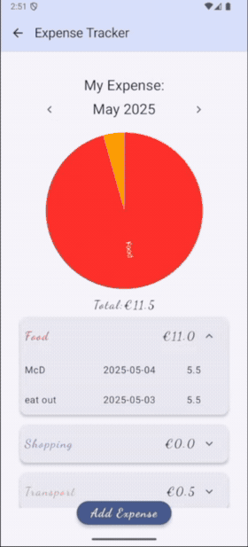
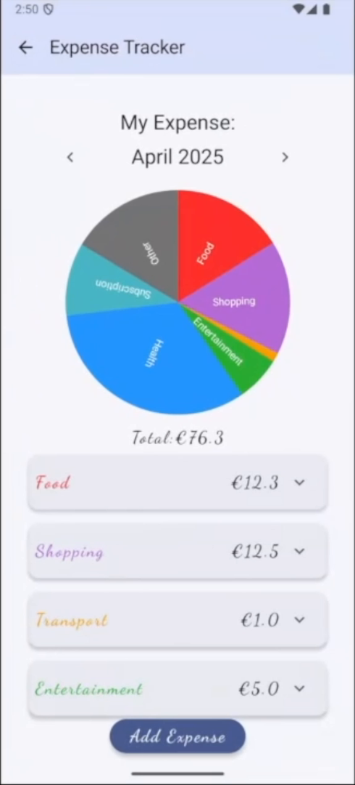
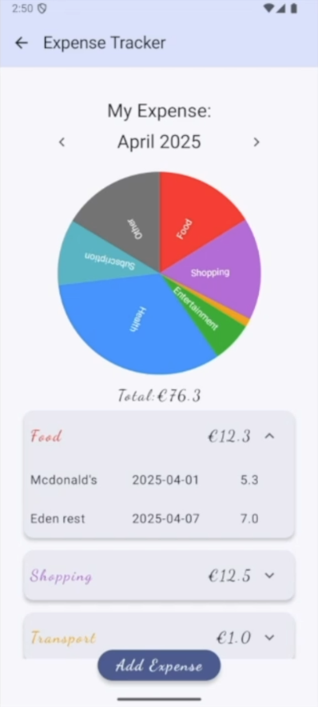
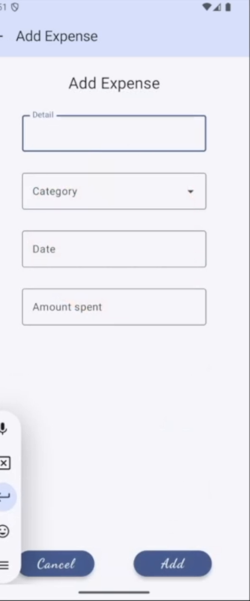
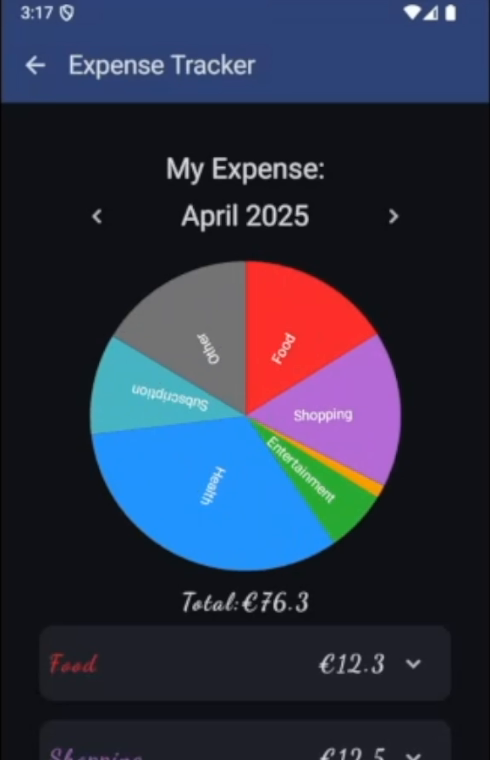

# Expense Tracker

An Android app for keeping track of everyday spending. Add an expense in a few taps, see where the
month's money actually went in a category pie chart, and drill into any category to see the
individual entries behind it.

Built with Kotlin and Jetpack Compose, with all data stored locally in a Room (SQLite) database —
no account, no network, no data leaves the device.

**[Download the latest APK](https://github.com/Xyang-git/Expense-Tracker/releases/latest)** —
no build tools needed, just Android 8.0 (API 26) or later.



## Features

- **Monthly view** — step backwards and forwards through months; each month has its own total.
- **Category pie chart** — spending split across Food, Shopping, Transport, Entertainment, Health,
  Subscription and Other, rendered with YCharts.
- **Expandable category rows** — tap a category to see every expense in it, with detail, date and
  amount.
- **Add expenses** with a detail note, category, date and amount.
- **Input validation** — an expense cannot be saved with an empty detail, an invalid amount, or a
  date that is not a real date in `YYYY-MM-DD` format. Each failure shows a dialog explaining what
  to fix.
- **Delete with confirmation** — deleting asks first, because it is permanent.
- **Dynamic theming** — colours follow the Android system theme, including dark mode (Material 3).
- **Offline by design** — everything persists locally through Room.

## Screenshots

| Monthly overview | Category breakdown | Add expense | Dark theme |
|---|---|---|---|
|  |  |  |  |

## Tech stack

| Area | Choice |
|---|---|
| Language | Kotlin |
| UI | Jetpack Compose, Material 3, Navigation Compose |
| Persistence | Room 2.6.1 with KSP |
| Charts | [YCharts](https://github.com/codeandtheory/YCharts) 2.1.0 |
| Build | Gradle (Kotlin DSL), JDK 11 |
| Min / target SDK | 26 / 34 (compiled against 35) |
| Testing | JUnit, AndroidX Test, Espresso, Compose UI test |

## Getting started

To just try the app, grab the APK from the
[latest release](https://github.com/Xyang-git/Expense-Tracker/releases/latest) and install it
(you may need to allow installs from unknown sources).

To build it yourself:

```bash
git clone https://github.com/Xyang-git/Expense-Tracker.git
```

Open the folder in Android Studio (Ladybug or newer), let Gradle sync, then run the `app`
configuration on an emulator or device running Android 8.0 (API 26) or later.

From the command line:

```bash
./gradlew assembleDebug     # build the APK
./gradlew test              # unit tests
./gradlew connectedCheck    # instrumented tests (needs a running device)
```

## How it works

Expenses are stored in a single Room table. The month view queries the expenses for the selected
month, groups them by category to build the pie chart and the per-category totals, and keeps the
selected month in UI state so the arrows simply re-query.

Validation happens before anything is written: the detail field must be non-empty, the amount must
parse as a number, and the date must parse as a real calendar date in `YYYY-MM-DD` — `2025-05-02`
is accepted, `20250502` and `2025-02-31` are not.

<!-- TODO: replace this section with the real class names once you tidy the package layout, e.g.
     ExpenseEntity / ExpenseDao / ExpenseDatabase / ExpenseViewModel and the composables. -->

## Roadmap

- [ ] Edit an existing expense, not just add and delete
- [ ] Budget per category, with a warning when a month goes over
- [ ] Export to CSV
- [ ] Unit tests for the validation rules and the monthly grouping
- [ ] Date picker instead of typed dates

## License

<!-- TODO: pick one. MIT is the usual choice for a portfolio project; add a LICENSE file to match. -->
MIT
